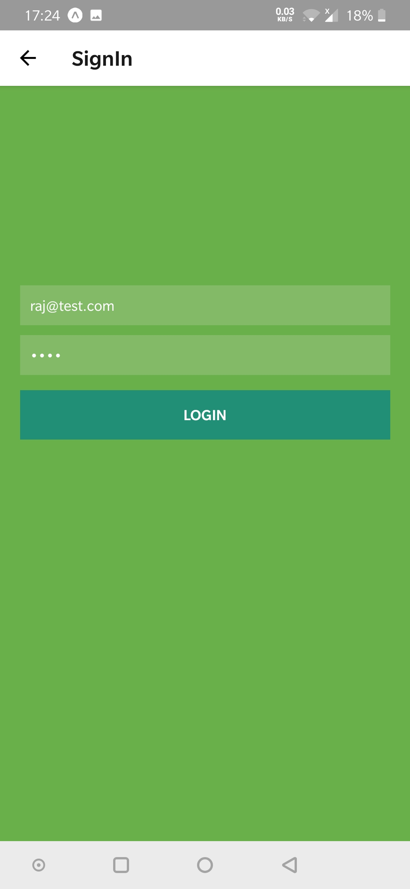

This is a react native project created with expo and python flask on backend

1. `npm install`
2. Change ip address in `components/meta.js` file
2. `expo start`
2. `cd PythonWebAPI`
2. `virtualenv myEnv`
3. `source ./myEnv/bin/activate`
4. `pip install -r requirement.txt`
6. import database from `PythonWebAPI/python_api_db.sql` file
7. Create `key.py` file and set `CLIENT_ID` from google console
8. `./run_py_server.sh`

## ScreenShots
<table>
<tr>
    <td>
        
    </td>
    <td>
        
    </td>
</tr>
<tr>
    <td>
        
    </td>
    <td>
        
    </td>
</tr>
<tr>
    <td>
        
    </td>
    <td>
        
    </td>
</tr>

</table>

## Notes
1. Password is stored as plain text for testing only
2. For development Phone and Laptop must be in same network
3. JWT might not be stored in db